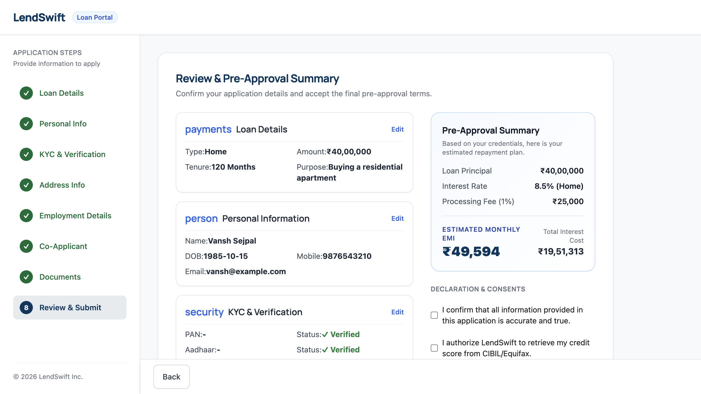
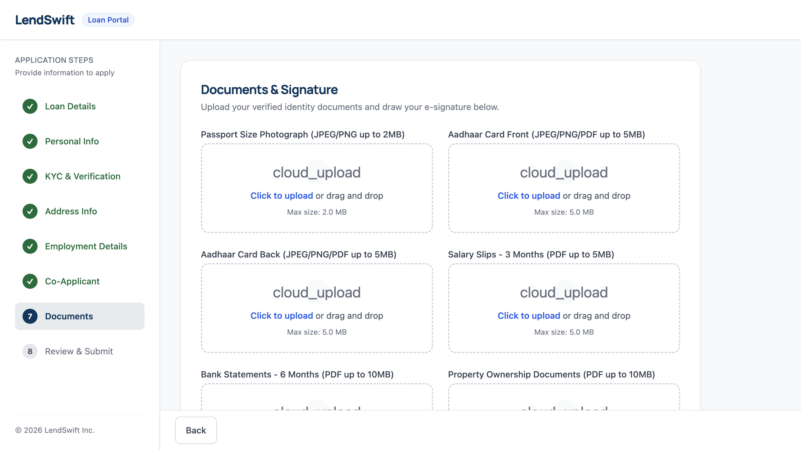
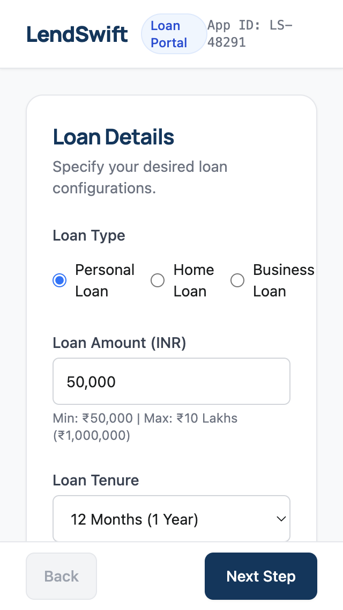

# LendSwift — Multi-Step Loan Application

> **A production-grade, cryptographically secure, fully accessible loan application form.**  
> Built with React 18, Vite, TypeScript, Tailwind CSS, and a 12-spec Cypress E2E test suite.

---

## 🚀 Live Demo

<!-- TODO: Add your Vercel / Netlify URL here after deployment -->
> **Deploy your app to Vercel or Netlify and paste your live URL here.**

---

## 📸 Screenshots

| Step 8 — Review & Pre-Approval | Step 7 — Document Upload | Mobile View |
|---|---|---|
|  |  |  |

---

## 📋 Project Overview

LendSwift is an 8-step multi-step loan application form that guides applicants through the complete loan application journey:

| Step | Name | Description |
|------|------|-------------|
| 1 | Loan Details | Select loan type (Personal / Home / Business), amount, tenure, purpose |
| 2 | Personal Information | Full name, DOB, gender, marital status, contact details |
| 3 | KYC & Verification | PAN + Aadhaar with simulated OTP verification |
| 4 | Address Details | Current and permanent address with real PIN code auto-fill |
| 5 | Employment & Income | Sub-forms for Salaried, Self-Employed, and Business Owner profiles |
| 6 | Co-Applicant *(conditional)* | Required for Home loans and high-value Personal/Business loans |
| 7 | Documents & Signature | File uploads with in-browser compression + digital signature pad |
| 8 | Review & Submit | Read-only summary, EMI calculator, consents, and final submission |

### Key Features

- 🔐 **AES-256-GCM Encrypted Auto-Save** — Draft data encrypted client-side via Web Crypto API and stored in `localStorage` with 72-hour TTL
- 📋 **Dynamic Schema Factory** — Zod validation schemas generated at runtime based on loan type, marital status, and employment profile
- 🗂️ **Conditional Wizard Routing** — Step 6 conditionally mounts based on real-time loan eligibility logic
- 🖼️ **Client-Side Image Compression** — HTML5 Canvas recursive quality reduction (0.7 → 0.35) with 1200px max dimension
- 🌐 **Real PIN Code Lookup** — Auto-fills city, district, state from a local 5,000+ PIN code dataset
- ♿ **WCAG 2.1 AA Compliant** — Automated axe-core audit passes on all 8 steps
- ⌨️ **Full Keyboard Accessibility** — Complete form navigation without any mouse interaction
- 📱 **Responsive Design** — Tested at 320px, 768px, and 1440px viewports

---

## 🛠️ Tech Stack

| Category | Technology |
|---|---|
| **Framework** | React 18 |
| **Build Tool** | Vite 5 |
| **Language** | TypeScript 5 |
| **Styling** | Tailwind CSS 3 |
| **Form Management** | React Hook Form 7 |
| **Validation** | Zod 3 |
| **Global State** | Zustand 4 |
| **File Uploads** | react-dropzone |
| **Signature Pad** | react-signature-canvas |
| **E2E Testing** | Cypress 13 |
| **A11y Testing** | cypress-axe + axe-core |
| **Unit Testing** | Vitest |
| **Linting** | ESLint (Airbnb config) |
| **Crypto** | Web Crypto API (AES-256-GCM) |

---

## ⚙️ Setup Instructions

### Prerequisites
- Node.js 18+ and npm 9+

### Install Dependencies
```bash
npm install
```

### Start Development Server
```bash
npm run dev
```
The app will be available at `http://localhost:5173`.

### Run Unit Tests
```bash
npm run test
```

### Run Linting
```bash
npm run lint
```

### Open Cypress Interactive Runner
```bash
npx cypress open
```

### Run All Cypress E2E Tests (Headless)
```bash
npx cypress run
```

---

## 🧪 Testing Strategy

The project includes **12 Cypress E2E spec files** covering happy paths, error handling, system resilience, accessibility, and UI layout — totalling **15+ distinct test journeys**.

### Happy Path Flows

| Spec | Journey |
|---|---|
| `personal-salaried-flow.cy.ts` | Personal Loan, Salaried employee, no co-applicant |
| `home-coapplicant-flow.cy.ts` | Home Loan, Married applicant, Spouse co-applicant (Step 6 required) |
| `business-owner-flow.cy.ts` | Business Loan, Business Owner profile (ITR + Business Reg docs) |

### System Resilience & Edge Cases

| Spec | What It Tests |
|---|---|
| `auto-save-resume.cy.ts` | Encrypts draft, reloads page, triggers recovery modal, resumes to saved step |
| `signature-lifecycle.cy.ts` | Draws, clears, and re-draws signature; verifies base64 capture and persistence across steps |
| `keyboard-navigation.cy.ts` | Completes the entire 8-step flow using **only** `{tab}`, `{enter}`, `{space}`, `{downarrow}` — zero mouse interactions |
| `stress-test.cy.ts` | Rapid Next button clicks (20× in 2s), double-submit prevention, 5,000+ character XSS payload injection, concurrent state mutation |
| `validation-errors.cy.ts` | Empty-state and field-level error messages verified across all 8 steps |
| `upload-errors.cy.ts` | Wrong file type rejection, oversized file rejection, drag-and-drop error states |

### Accessibility & UI

| Spec | What It Tests |
|---|---|
| `accessibility.cy.ts` | WCAG 2.1 AA audit via `cypress-axe` on all 8 steps + success modal (0 violations) |
| `layout.cy.ts` | App mount and correct initial render |
| `screenshots.cy.ts` | Automated viewport screenshots at 320px (mobile) and 1440px (desktop) for all 9 screens |

### Unit Tests

| File | Coverage |
|---|---|
| `emiCalculator.test.ts` | EMI formula accuracy across 15+ loan amount/tenure/rate combinations |
| `schemaFactory.test.ts` | All 6 dynamic schema generators with boundary conditions |
| `encryption.test.ts` | AES-256-GCM round-trip encrypt/decrypt with tamper detection |
| `imageCompression.test.ts` | Canvas pipeline with oversized and correctly-sized mock images |

---

## 📁 Project Structure

```
ZeTheta/
├── src/
│   ├── components/
│   │   ├── common/         # Reusable: Checkbox, RadioGroup, FileUpload, SignaturePad, etc.
│   │   ├── Step1LoanDetails.tsx
│   │   ├── Step2PersonalInfo.tsx
│   │   ├── Step3KYC.tsx
│   │   ├── Step4Address.tsx
│   │   ├── Step5Employment.tsx
│   │   ├── Step6CoApplicant.tsx
│   │   ├── Step7Documents.tsx
│   │   ├── Step8Review.tsx
│   │   └── MainLayout.tsx
│   ├── hooks/
│   │   ├── useAutoSave.ts          # AES-256-GCM encrypted draft saver
│   │   ├── useFormPersistence.ts   # 72-hour TTL draft hydration
│   │   ├── usePinCodeLookup.ts     # Real-time PIN → city/state lookup
│   │   └── useVerification.ts      # PAN + Aadhaar OTP simulation
│   ├── schemas/                    # Per-step Zod schemas
│   ├── store/
│   │   └── formStore.ts            # Zustand wizard state machine
│   ├── utils/
│   │   ├── encryption.ts           # Web Crypto AES-256-GCM utilities
│   │   ├── imageCompression.ts     # Canvas recursive compression
│   │   ├── schemaFactory.ts        # Dynamic schema generator
│   │   ├── emiCalculator.ts        # Reducing balance EMI formula
│   │   ├── sanitizer.ts            # XSS input sanitizer
│   │   └── validators.ts           # PAN entity code validator
│   └── data/
│       └── pinCodeData.json        # 5,000+ Indian PIN codes
├── cypress/
│   ├── e2e/                        # 12 spec files
│   ├── fixtures/                   # test-image.png, test-document.pdf
│   └── support/
│       └── e2e.ts                  # cypress-axe import + custom commands
├── docs/                           # Automated viewport screenshots
├── ARCHITECTURE.md                 # Deep-dive technical documentation
└── README.md                       # This file
```

---

## 🏗️ Architecture Highlights

For a deep-dive into the four core engineering systems, see [ARCHITECTURE.md](./ARCHITECTURE.md):

1. **Wizard State Machine** — Zustand store with 400ms cooldown guard and cascading cross-step invalidation
2. **Dynamic Schema Factory** — Runtime Zod schema generation with `superRefine` cross-field rules
3. **Web Crypto Auto-Save** — AES-256-GCM encryption pipeline with 72-hour TTL draft recovery
4. **Client-Side Image Pipeline** — HTML5 Canvas recursive quality reduction (0.7→0.35)

---

## 🚢 Deployment

### Deploy to Vercel (Recommended)

1. Push your repository to GitHub
2. Go to [vercel.com](https://vercel.com) and sign in
3. Click **"New Project"** and import your repository
4. Leave all settings as default — Vite is auto-detected
5. Click **Deploy**

### Deploy to Netlify

1. Go to [netlify.com](https://netlify.com) and sign in
2. Click **"Add new site → Import an existing project"**
3. Connect your GitHub repository
4. Set build command: `npm run build`
5. Set publish directory: `dist`
6. Click **Deploy**

---

## 📄 License

MIT License — see `LICENSE` for details.

---

*Built as part of the ZeTheta 15-Day Engineering Challenge.*